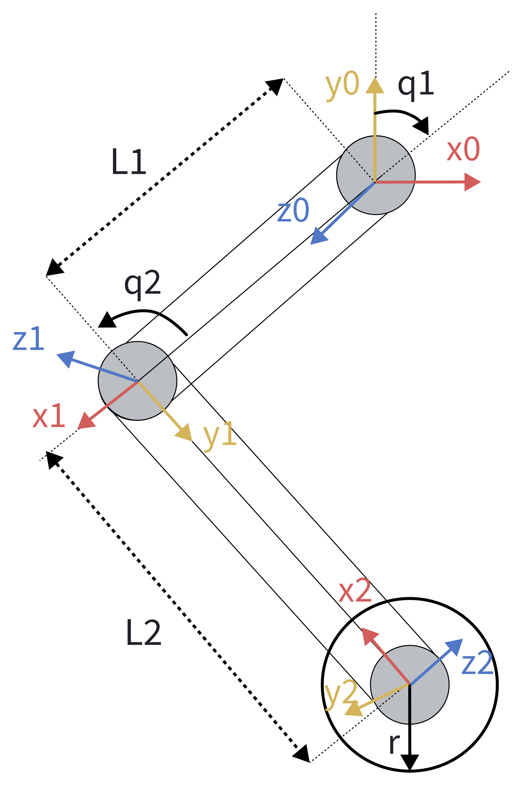

# 论文标题 基于麦克纳姆轮的四足轮式六轴机械臂机器人轻量化结构与低硬件依赖低能耗控制方案，与基于Delta机械臂的通用机械臂遥操作控制器构型与高精度算法

> 提示：标题中不要用符号、特殊字符、脚注或数学公式；避免缩写，除非不可避免。

**作者一**¹，**作者二**¹，**作者三**²

¹ 所属部门，所属组织，城市，国家
² 所属部门，所属组织，城市，国家

邮箱：author1@example.com，author2@example.com，author3@example.com

---

## 摘要（Abstract）

搭载机械臂的四足机器人兼具复杂地形通过性与灵活的环境操作能力，在灾害救援、危险环境、园区巡检作业等场景中具有广泛应用前景。然而，现有的工业四足机器人——16自由度的点足式或常规轮足式—无法兼顾灵活性与低功耗性。本文提出了一种基于麦克纳姆轮的四足轮式六轴机械臂机器人轻量化结构设计与低硬件依赖低能耗控制方案，并与基于Delta机械臂的通用机械臂遥操作控制器构型及高精度算法进行了结合。通过优化机械结构和控制算法，实现了机器人在复杂环境下的高效运动与操作能力。实验结果表明，所提出的方法在能耗、精度和适应性方面可有效弥补现有技术的不足，为未来多功能移动操作机器人提供了新的设计思路。

**关键词（Keywords）**：[四足机器人，麦克纳姆轮，机械臂，轻量化，低能耗，通用遥操作，高精度]

---

## I. 引言（Introduction）

[研究背景与动机。]

[现有工作的不足，简要文献综述。]

[本文的贡献与创新点。]

[论文组织结构（可选）。]

---

## II. 相关工作（Related Work）

[概述与本文最相关的已有研究，指出其局限，说明本文与其区别。]

---

## III. 提出的方法（Proposed Method）

<!-- ### 硬件框图 -->
### 底盘模块

#### 概述
底盘模块主要由基座与4条腿组成，其中基座上部与机械臂模块相连，基座左前、右前、左后、右后分别与4条腿相连。每条腿由轴平行的一个髋关节（俯仰方向）、一个膝关节以及一个麦克纳姆轮组成。整个底盘共12自由度，尽管相比常规轮足机器人减省了4个髋关节（滚转方向），但麦克纳姆轮的单方向约束特性能够给予底盘不输乃至更高于常规轮足机器人的转向灵活性，另外也大大降低了机器人的整体重量和功耗。本文提出的控制方案使用了自底向上的分层控制结构，先单独分析单条腿，再将底盘模块与机械臂模块整体视为一个单刚体分析，最终达到对机器人的线速度、角速度、以及姿态角的闭环控制。
[整体控制框图示意图]
#### 运动学模型
1. 单腿运动学模型
    为了方便进行后续关节角映射与静力学的推导，本文先对单条腿进行运动学分析，建立单腿坐标系，并在此基础上建立底盘模块的整体运动学模型。

    本文记号约定如下：标量用斜体表示，矢量用粗斜体表示，矩阵用粗正体表示；矢量 $\boldsymbol{v}$ 的第 $i$ 个分量记为标量 $v_i$。
    - 单腿运动学
    
    [单腿坐标系示意图]

    在单腿坐标系示意图中，定义坐标系{0}为腿基坐标系，以{leg}表示，在讨论单条腿时不再对4条腿各自的腿基坐标系做区分。

    |物理量|单位|数值或范围|含义|
    |------|----|----|----|
    |$L_1$|m||大腿长|
    |$L_2$|m||小腿长|
    |$q_1$|rad||髋关节角度|
    |$q_2$|rad||膝关节角度|
    |$\boldsymbol{p}_{\text{ankle}}^{\text{leg}}$|m||由腿基坐标系原点到足端的位置向量|

    [单腿物理量定义表]

    - 正运动学
        $$
        \begin{aligned}
        x_{\text{ankle}}^{\text{leg}} &= L_1 \sin(q_1) + L_2 \sin(q_1 + q_2) \\
        y_{\text{ankle}}^{\text{leg}} &= -L_1 \cos(q_1) - L_2 \cos(q_1 + q_2)
        \end{aligned}
        $$

        其中 $x_{\text{ankle}}^{\text{leg}}$ 和 $y_{\text{ankle}}^{\text{leg}}$ 分别表示足端在腿基坐标系中的 x 和 y 坐标。

    - 逆运动学
        将正运动学公式进行变形，可得到逆运动学公式。
        设
        $$
        r = \sqrt{{x_{\text{ankle}}^{\text{leg}}}^2 + {y_{\text{ankle}}^{\text{leg}}}^2}, \qquad
        \alpha = \arccos\left(\frac{L_1^2 - L_2^2 + {x_{\text{ankle}}^{\text{leg}}}^2 + {y_{\text{ankle}}^{\text{leg}}}^2}{2L_1 r}\right), \qquad
        \beta = \arccos\left(\frac{x_{\text{ankle}}^{\text{leg}}}{r}\right)
        $$
        逆运动学公式为：
        $$
        \begin{aligned}
        q_1 &= \frac{\pi}{2} - \alpha - \beta \\[4pt]
        q_2 &= \operatorname{atan2}\!\Big(y_{\text{ankle}}^{\text{leg}} + L_1\sin(\alpha + \beta),\;\; x_{\text{ankle}}^{\text{leg}} - L_1\cos(\alpha + \beta)\Big) + \alpha + \beta
        \end{aligned}
        $$

    [单腿运动学公式]

2. 麦克纳姆轮运动学
    [介绍一下麦克纳姆轮的结构和工作原理]
    [麦克纳姆轮结构示意图]
    
    [麦克纳姆轮运动学示意图] 

    在麦克纳姆轮运动学示意图中，在底盘基座中心定义与底盘基座固连的坐标系，以{body}表示，简记为{b}，其中{b}的原点位于底盘基座中心，x轴指向前方，y轴指向左方，z轴指向上方。为简化分析，对麦克纳姆轮的的运动学建模将假设底盘基座始终水平。

    |物理量|单位|数值或范围|含义|
    |------|----|----|----|
    |$\boldsymbol{p}_i$|m||由{b}原点到第$i$个麦克纳姆轮中心点的位置向量，$i$表示第$i$个麦克纳姆轮，由左前起逆时针从1到4编号|
    |$\boldsymbol{\omega}_b$|rad/s||底盘基座在竖直方向的角速度矢量|
    |$\boldsymbol{v}_b$|m/s||底盘基座在水平方向的线速度矢量|
    |$\boldsymbol{v}_i$|m/s||第$i$个麦克纳姆轮中心点在水平方向的线速度矢量|
    |$\omega_i$|rad/s||第$i$个麦克纳姆轮的轮毂相对其对应小腿的角速度|
    |$R$|m||麦克纳姆轮的有效滚动半径|
    |$\boldsymbol{a}_i$|—||第$i$个麦克纳姆轮的轮轴方向单位矢量|
    |$\boldsymbol{d}_i$|—||第$i$个麦克纳姆轮的滚动方向单位矢量，$\boldsymbol{d}_i = \hat{\boldsymbol{z}} \times \boldsymbol{a}_i$，$\hat{\boldsymbol{z}}$为竖直向上单位矢量|
    |$\boldsymbol{n}_i$|—||第$i$个麦克纳姆轮辊子轴线方向的单位矢量|
    |$\theta_i$|rad||第$i$个麦克纳姆轮辊子滚动方向与轮轴方向的夹角，$\theta_i = \pm\pi/4$|
    |$\boldsymbol{v}_{r,i}$|m/s||第$i$个麦克纳姆轮辊子与地面接触点的速度矢量|
    |$v_{d,i}$|m/s||$\boldsymbol{v}_i$沿滚动方向$\boldsymbol{d}_i$的分量|
    |$v_{a,i}$|m/s||$\boldsymbol{v}_i$沿轮轴方向$\boldsymbol{a}_i$的分量|

    [麦克纳姆轮物理量定义表]

    根据伽利略相对性原理，麦克纳姆轮中心点的线速度可由底盘基座的线速度与角速度叠加得到：
    $$
    \boldsymbol{v}_i = \boldsymbol{v}_b + \boldsymbol{\omega}_b \times \boldsymbol{p}_i
    $$
    由于麦克纳姆轮结构的特殊性，其辊子滚动方向与轮毂旋转轴线方向之间存在一个固定的夹角 $\theta_i = \pm\pi/4,\ i=1,2,3,4$。记第 $i$ 个麦克纳姆轮的轮轴方向单位矢量为 $\boldsymbol{a}_i$，滚动方向单位矢量为 $\boldsymbol{d}_i = \hat{\boldsymbol{z}} \times \boldsymbol{a}_i$，辊子轴线方向的单位矢量为 $\boldsymbol{n}_i$。将轮心速度 $\boldsymbol{v}_i$ 沿 $\boldsymbol{d}_i$ 与 $\boldsymbol{a}_i$ 分解，两个分量分别记为 $v_{d,i}$ 与 $v_{a,i}$。麦克纳姆轮在辊子轴线方向 $\boldsymbol{n}_i$ 上不产生滑动，即辊子与地面接触点的速度 $\boldsymbol{v}_{r,i}$ 沿该方向的分量恒为零。

    由上述纯滚动约束出发，消去接触点速度 $\boldsymbol{v}_{r,i}$ 并代入速度叠加公式，即可解出第 $i$ 个麦克纳姆轮的轮毂角速度
    $$
    \omega_i = \frac{1}{R} \left[ \boldsymbol{v}_i \cdot \boldsymbol{d}_i - \left( \boldsymbol{v}_i \cdot \boldsymbol{a}_i \right) \cot(\theta_i) \right]
    $$
    式中第一项对应普通车轮的纯滚动条件，第二项为麦克纳姆轮特有的辊子侧向约束贡献。由于 $\cot(\pi/4) = 1$、$\cot(-\pi/4) = -1$，两侧轮子按辊子手性分别取加号或减号。

    [麦克纳姆轮运动学公式]

#### 力矩前馈控制器
    四足机器人是一个高自由度的系统，若直接按照标准的刚体动力学方法对机器人的每一个连杆进行动力学分析，不仅计算困难、过程冗长，而且计算量也很大，难以在单片机一类的低算力平台上实时计算。为解决传统方法的困境，本文结合了虚功原理和单刚体简化建模的思想，提出了单腿足端力映射模型+整机单刚体模型的分层式计算模型。
1. 足端力映射
    足端力映射是指将足端力映射到小腿连杆的关节力矩。包括了麦克纳姆轮建模和腿部2DOF连杆建模。
    - 麦克纳姆轮
        由于麦克纳姆轮的质量相对较大（单个约0.547kg），因此有必要对其进行单独建模。
        
        [麦克纳姆轮物理量示意图]
        |物理量|单位|数值或范围|含义|
        |------|----|----|----|
        |$\boldsymbol{\tau}_w$|N·m||轮电机对轮的力矩|
        |$\boldsymbol{F}_e$|N||地面对轮的力，即足端力|
        |$\boldsymbol{F}_w$|N||小腿连杆对轮的力|
        |$\mathbf{I}_c$|kg·m²||轮绕质心的惯性张量|
        |$\boldsymbol{v}_c$|m/s||轮的质心速度|
        |$m_w$|kg||轮的质量|
        |$\boldsymbol{\omega_w}$|rad/s||轮相对于惯性系的角速度|
        |$\boldsymbol{r}_{ce}$|m||质心到触地点的位矢|
        |$\boldsymbol{G}_w$|N||轮所受重力|

        [麦克纳姆轮物理量定义]

        对麦克纳姆轮应用牛顿方程，可得其平动动力学方程：
        $$
        m_w \dot{\boldsymbol{v}}_c = \boldsymbol{F}_e + \boldsymbol{F}_w + \boldsymbol{G}_w 
        $$
        经过变形后可以得到
        $$
        \boldsymbol{F}_w =  m_w \dot{\boldsymbol{v}}_c - \boldsymbol{F}_e -\boldsymbol{G}_w
        $$
        由于期望的所有运动学量（位置、速度、加速度等，不含力与力矩）和轮的固定参数是已知的，故只需要有足端力$\boldsymbol{F}_e$即可算出期望的小腿连杆对轮的力 $\boldsymbol{F}_w$

        [麦克纳姆轮动力学公式]
    - 腿部2DOF连杆力映射
    腿部连杆使用虚功原理，可以将小腿连杆对轮的力与力矩映射到髋关节和膝关节的力矩，从而进一步映射到电机的输出力矩。
        
        |物理量|单位|数值或范围|含义|
        |------|----|----|----|
        |$\boldsymbol{q}$|rad||关节角度，$\boldsymbol{q} = [q_1, q_2]^T$|
        |$\boldsymbol{j}$|rad||电机转角，$\boldsymbol{j} = [j_1, j_2]^T$|
        |$\mathbf{A}$|—|$\begin{bmatrix} 1 & 0 \\ -1 & 1 \end{bmatrix}$|传动比矩阵，$\boldsymbol{q} = \mathbf{A}\boldsymbol{j}$|
        |$\boldsymbol{\tau}$|N·m||虚拟关节驱动力矩，$\boldsymbol{\tau} = [\tau_1, \tau_2]^T$|
        |$\boldsymbol{r}_w$|m||轮质心位矢|
        |$q_w$|rad|$q_1 + q_2$|连杆 2 末端转角|
        |$\tau_w$|N·m||轮电机对轮的力矩，标量，沿{w}的y轴正方向为正|

        [足端力映射物理量]

        在腿基坐标系 $\{leg\}$ 下，驱动力为关节力矩
        $$
        \boldsymbol{\tau} = [\tau_1, \tau_2]^T
        $$
        环境力为轮对小腿连杆的作用力与力矩，即 $[-\boldsymbol{F}_w^T, -\tau_w^T]^T$。驱动力虚功为
        $$
        \delta W_\tau = \boldsymbol{\tau}^T \delta \boldsymbol{j}
        $$
        轮对小腿连杆的虚功为
        $$
        \delta W_w = -\boldsymbol{F}_w^T \delta \boldsymbol{r}_w - \tau_w \delta q_w
        $$
        式中 $\tau_w$ 为标量。由虚功平衡方程
        $$
        \delta W_\tau + \delta W_w = 0
        $$
        将上述虚功表达式代入并展开，可得
        $$
        \boldsymbol{\tau}^T \mathbf{A}^{-T} \delta \boldsymbol{q} - \boldsymbol{F}_w^T \mathbf{J}(\boldsymbol{r}_w, \boldsymbol{q}) \delta \boldsymbol{q} - \tau_w \delta (q_1 + q_2) = 0
        $$
        进一步整理为
        $$
        \left[ \boldsymbol{\tau}^T \mathbf{A}^{-T} - \boldsymbol{F}_w^T \mathbf{J}(\boldsymbol{r}_w, \boldsymbol{q}) - [\tau_w, \tau_w] \right] \delta \boldsymbol{q} = 0
        $$
        可以得到足端力映射公式：
        $$
        \boldsymbol{\tau} = \mathbf{A} \left( \mathbf{J}(\boldsymbol{r}_w, \boldsymbol{q})^T \boldsymbol{F}_w + [\tau_w, \tau_w]^T \right)
        $$
        其中 $\mathbf{J}(\boldsymbol{r}_w, \boldsymbol{q})$ 为小腿连杆的雅可比矩阵。

        [足端力映射推导公式]
   - 单刚体动力学
    将整个机器人视为单个刚体，建立其动力学模型。
    
    [单刚体动力学物理量定义]
    [单刚体动力学公式]

2. 姿态控制器
   - 增量式PID控制器
    [增量式PID控制器公式]

### 机械臂模块
#### 概述
机械臂模块主要由6个旋转关节与一个夹爪构成。机械臂关节轴布置采用了经典的Elbow-Wrist结构，关节轴的空间位置与方向均经过优化设计，以兼顾机械臂的工作空间、负载能力、刚度以及运动学可解性；夹爪采用了连杆-滑轨结构，开合速度快，开合范围大，整体质量轻。
[整体控制数据通路框图示意图。]
#### 运动学模型
1. DH坐标系
[DH坐标系定义图]
[DH参数表]
1. 正运动学
[正运动学公式]
2. 逆运动学
[逆运动学公式]
#### 动力学模型
1. 牛顿-欧拉法
[牛顿-欧拉法公式]
#### 控制器设计
1. 单关节串级PID
[串级PID控制器框图]
   - 串级PID
   - 力矩前馈
   - 速度前馈
#### 参考量计算链路
1. 单关节角度控制
   - TD跟踪微分器 
    [TD跟踪微分器公式]
2. 笛卡尔空间控制
   - 使用逆运动学
   - TD跟踪微分器
3. 关节空间轨迹规划
[五次样条插值公式]

### Delta遥操作控制器
#### 正运动学
#### 力矩前馈

---

## IV. 实验与结果（Experiments and Results）

### A. 数据集与评估指标（Dataset and Metrics）

[说明数据集来源、规模、预处理方式；评估指标定义。]

### B. 实验设置（Experimental Setup）

[硬件、软件、参数配置、对比方法。]

### C. 结果与分析（Results and Analysis）

[呈现主要结果，配图表并分析。]

> 图题写在图下方，表题写在表上方；正文引用图用 "Fig. 1"，表用 "TABLE I"。

**表 I. 表格标题**

| 方法 | 指标1 | 指标2 | 指标3 |
|------|-------|-------|-------|
| 对比方法A | — | — | — |
| 对比方法B | — | — | — |
| **本文方法** | — | — | — |

*表脚注示例。*

### D. 讨论（Discussion）

[解释结果原因，与已有工作对比，说明局限性。]

---

## V. 结论（Conclusion）

[总结主要发现与贡献。]

[指出局限性。]

[展望未来工作。]

---

## 致谢（Acknowledgment）

[感谢资助机构、提供帮助的个人或组织。赞助方致谢可放在第一页未编号脚注中。]

---

## 参考文献（References）

[1] [作者. 文献标题. 期刊/会议名称, 卷, 期, 页码, 年份.]

[2] [作者. 书名. 版本. 出版地: 出版社, 年份, 页码.]

[3] [作者. 论文标题. 会议名称, 年份, 页码.]

> 提示：
> - 按正文引用顺序连续编号，方括号 [1]。
> - 正文中直接写编号，如 [3]，不用 "Ref. [3]" 或 "reference [3]"，除非在句首。
> - 六位及以上作者才可用 "et al."，否则列出全部作者。
> - 未发表论文标 "unpublished"，已接受待发表标 "in press"。
> - 论文标题只首词大写（专有名词、元素符号除外）。
> - 翻译期刊论文：先英文引用，后原始外文引用，如 [6]。