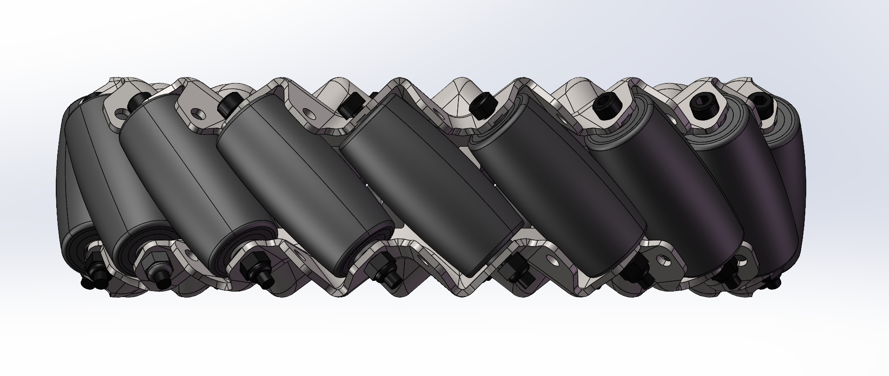
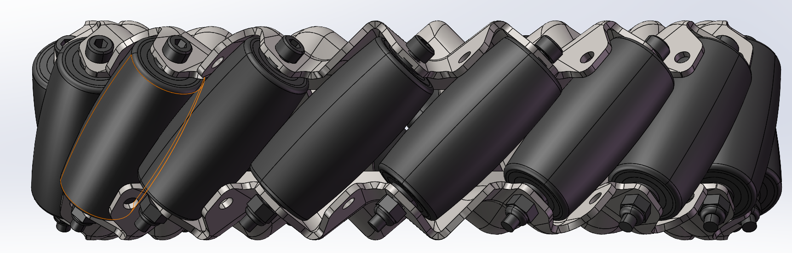

# 麦克纳姆轮四足移动机械臂的轻量化设计与基于 Delta 机构的异构遥操作控制

作者、单位及通信邮箱：待作者确认。

## 摘要（Abstract）

搭载机械臂的四足机器人兼具地形适应能力和环境操作能力，在灾害救援、危险环境作业与园区巡检等场景中具有应用价值。面向移动灵活性、结构质量和嵌入式计算资源之间的折中，本文提出一种麦克纳姆轮四足移动机械臂及其异构遥操作系统。底盘每腿保留两个俯仰关节和一个车轮驱动自由度，通过麦克纳姆轮的方向约束实现平面全向运动；控制上采用单腿虚功映射与整机单刚体模型相结合的分层力矩前馈，并通过姿态反馈调整腿长。六轴机械臂采用解析逆运动学、重力补偿及轨迹平滑，主端采用 Delta 并联机构与三编码器手柄分别输入末端位置和姿态。已有技术报告记录了底盘越障、姿态调节和主端重力补偿的功能演示，以及机械臂关节阶跃响应的改善。上述记录支持模块级实现的可行性；整机能耗、末端定位精度及重复任务成功率仍需统一测量验证。

**关键词（Keywords）**：轮足机器人，麦克纳姆轮，移动操作，轻量化设计，力矩前馈，异构遥操作。

## I. 引言（Introduction）

非结构化环境中的移动作业不仅要求机器人抵达目标区域，还要求其完成抓取、搬运和设备操作。腿式机构能够调整支撑位置与机身姿态，车轮有利于连续滚动，机械臂则提供独立的末端作业空间。将三者结合，可以扩大机器人可执行任务的范围，但也引入了质量分布变化、轮地接触约束以及主从运动映射等问题。

已有轮足移动操作研究分别从学习控制、机构重构和人机交互等方向开展探索。Wang 等利用带机械臂约束的课程学习实现轮足机器人的移动操作 [1]；Zhang 等通过主动对接机构和模块化控制实现轮足双臂机器人的构型切换 [2]；Cruz Ulloa 等将混合现实遥操作用于四足机械臂搜救辅助任务 [3]。这些工作表明，运动与操作的结合具有实际价值，也说明控制策略需要与机构、执行器和任务条件共同设计。

本文关注采用微控制器部署的轮足移动操作平台。相对于每腿包含三个腿部转动关节及一个轮驱动的四轮足构型，本文底盘省去四个髋部滚转自由度，以麦克纳姆轮的平面全向运动能力补充转向与侧移能力。这里的十二自由度与十六自由度比较仅针对底盘主动自由度，不包括六轴机械臂和夹爪，也不将所有点足或轮足机器人概括为同一种构型。减少执行器数量为降低质量和控制复杂度提供了结构基础，实际节能效果仍取决于传动、滚动损耗和运动工况。

本文沿用技术报告 [4] 的系统路线，并参考仓库机械设计资料 [5] 补充结构说明，主要贡献为：第一，将两关节轮腿、麦克纳姆轮及六轴夹爪机械臂集成为移动操作平台；第二，建立从整机期望合力与合力矩到足端力、关节力矩和电机力矩的分层映射，结合姿态反馈形成便于嵌入式实现的控制链；第三，通过 Delta 三平移机构和三转动编码器手柄构成异构主端，结合解析逆解、信号平滑及底盘平移补偿完成末端位姿输入。本文对已有记录进行整理和分析，不将尚未完成的约束优化或未测量的性能指标作为实验结果。

## II. 相关工作（Related Work）

### A. 轮足移动操作与整机控制

移动机械臂的控制需要兼顾机身稳定与末端运动。[1] 将机械臂约束引入强化学习，并通过课程设计协调移动与操作；其方法包含训练、策略部署和实机验证环节。[2] 采用虚拟模型控制与线性二次调节器，并对多模块连接后的姿态和转向进行协调。这些工作面向不同机构和任务，不能直接用其性能数字与本文平台作横向比较。

本文采用解析运动学、刚体近似和关节反馈，重点是形成可解释、可分模块调试的控制流程。单刚体模型省略了部分连杆惯性和快速运动耦合，计算负担较小，但其适用范围也相应受限。技术报告讨论了带摩擦约束的二次规划及后续模型预测控制路线，同时明确说明演示阶段尚未实现二次规划前馈 [4]。因此，本文保留原稿中的最小范数分配作为简化基线，并说明其物理可行性条件。

### B. 遥操作与异构主端

[3] 通过混合现实接口改善四足机械臂的任务交互，表明操作者输入方式会影响移动操作的执行过程。本文采用实体位姿输入装置：Delta 并联机构测量手柄平移，串联的三转动机构测量手柄姿态。主端与从端无需具有相同关节构型，其联系由笛卡尔空间映射建立。

位置缩放、坐标校准和关节解支选择决定了异构映射的连续性；编码器分辨率本身并不等于末端定位精度。本文主端的力矩前馈用于抵消自身重力，现有资料未提供从端接触力回传和双边力反馈实验，故不将其表述为已实现环境力觉再现的系统。

## III. 提出的方法（Proposed Method）

### A. 系统结构与符号约定

系统由十二自由度四轮足底盘、六转动关节机械臂及单自由度夹爪、Delta 异构遥操作控制器组成。机器人端共有十九个主动自由度；主端的三个平移自由度与三个姿态输入自由度单独计数。底盘上层框架采用碳纤维方管，下层采用铝方管，并结合碳纤维板与铝制连接件形成分层结构。两路腿部驱动集中在髋部，通过平行四边形机构传递膝部运动，降低电机随小腿摆动的惯量。机械臂采用碳纤维板和铝制加工件，夹爪采用连杆与滑轨结构 [5]。这些设计体现轻量化目标，但现有资料尚不足以给出等强度结构的减重百分比。

控制流程如 Fig. 1 所示。底盘控制器接收期望平面速度、机身高度和姿态，分别计算轮速、关节位置及前馈力矩；机械臂控制器接收主端位姿，经坐标映射、逆解与平滑后生成关节指令。关节层采用位置与速度串级反馈，模型前馈与反馈输出在执行器侧叠加。

<!-- FIGURE_SLOT:1 -->

*Fig. 1. 整体结构与分层控制框图（留白，待补图）。*

标量采用斜体，矢量采用粗斜体，矩阵采用粗正体；描述性下标、单位和函数名称采用正体。上标 $\mathsf{T}$ 表示转置，$\dagger$ 表示 Moore–Penrose 伪逆；$[\boldsymbol{x}]_\times\boldsymbol{y}=\boldsymbol{x}\times\boldsymbol{y}$。$\mathbf{I}_n$ 为 $n$ 阶单位矩阵，惯性张量另记为 $\mathbf{I}_{\mathrm{c}}$ 或 $\mathbf{I}_{\mathrm{b}}$。符号 $\mathrm{d}$、$\mathrm{ff}$ 和 $\mathrm{fb}$ 分别表示期望、前馈和反馈量。长度、时间和角度统一采用国际单位制。

定义惯性系 $\{\mathrm{s}\}$ 的竖直轴向上；机体系 $\{\mathrm{b}\}$ 固连底盘，原点位于基座中心，$x$ 轴向前、$y$ 轴向左、$z$ 轴向上。腿基系 $\{\mathrm{l}_i\}$ 位于第 $i$ 个髋部，腿部运动平面为其 $xy$ 平面。$\mathbf{R}_{\mathrm{s}\mathrm{b}}$ 将机体系分量变换至惯性系。力矩计算涉及的各矢量必须先变换至同一坐标系；基座中心与整机质心不重合时，力臂必须相对于质心重新计算。

### B. 底盘模块

#### 1) 概述与单腿运动学

底盘由基座与四条腿组成，每条腿包含轴线平行的髋部俯仰关节、膝关节和一个麦克纳姆轮，共十二个主动自由度。控制沿用“单腿建模—整机合力分配—关节执行”的分层结构。腿部关节调整支撑高度与前后轮心位置，车轮负责平面滚动。

设单腿关节角为 $\boldsymbol{q}_{\mathrm{l}}=[q_{\mathrm{l},1},q_{\mathrm{l},2}]^{\mathsf{T}}$，大腿和小腿长度为 $L_1,L_2$；轮心位置为 $\boldsymbol{p}_{\mathrm{a}}^{\mathrm{l}}=[x_{\mathrm{a}},y_{\mathrm{a}},0]^{\mathsf{T}}$。此处将原稿“足端位置”明确为轮轴中心，区别于轮地触点。零位为两连杆沿腿基系负 $y$ 轴伸直，关节角正向由下式确定。Fig. 2 预留相应坐标图。

<!-- FIGURE_SLOT:2 -->

*Fig. 2. 单腿坐标系、关节角零位与轮心位置（留白；现有示意图角度基准需与正文统一）。*

**TABLE I. 单腿几何与传动参数**

| 符号 | 数值或单位 | 定义 |
|---|---|---|
| $L_1$ | $0.170\,\mathrm{m}$ | 大腿关节中心距 [5] |
| $L_2$ | $0.220\,\mathrm{m}$ | 小腿关节中心距 [5] |
| $q_{\mathrm{l},1},q_{\mathrm{l},2}$ | $\mathrm{rad}$ | 等效串联关节角 |
| $\boldsymbol{\eta}_{\mathrm{l}}$ | $\mathrm{rad}$ | 两路髋部驱动输出轴角 |
| $m_{\mathrm{w}}$ | $0.547\,\mathrm{kg}$ | 单轮模型质量 [4] |
| $r_{\mathrm{w}}$ | $\mathrm{m}$，待标定 | 车轮有效滚动半径 |

忽略连杆弹性，单腿正运动学为

$$
\begin{aligned}
x_{\mathrm{a}}&=L_1\sin q_{\mathrm{l},1}+L_2\sin(q_{\mathrm{l},1}+q_{\mathrm{l},2}),\\
y_{\mathrm{a}}&=-L_1\cos q_{\mathrm{l},1}-L_2\cos(q_{\mathrm{l},1}+q_{\mathrm{l},2}).
\end{aligned}
\tag{1}
$$

保留原稿的几何逆解分支，定义

$$
\begin{aligned}
\rho_{\mathrm{l}}&=\sqrt{x_{\mathrm{a}}^2+y_{\mathrm{a}}^2},\\
\alpha_{\mathrm{l}}&=\arccos\frac{L_1^2-L_2^2+\rho_{\mathrm{l}}^2}{2L_1\rho_{\mathrm{l}}},\\
\beta_{\mathrm{l}}&=\operatorname{atan2}(-y_{\mathrm{a}},x_{\mathrm{a}}).
\end{aligned}
\tag{2}
$$

在原稿所用轮心位于髋部下方的分支内，$\beta_{\mathrm{l}}$ 与 $\arccos(x_{\mathrm{a}}/\rho_{\mathrm{l}})$ 等价；使用双参数反正切可明确象限。令 $\gamma_{\mathrm{l}}=\alpha_{\mathrm{l}}+\beta_{\mathrm{l}}$，有

$$
\begin{aligned}
q_{\mathrm{l},1}&=\frac{\pi}{2}-\gamma_{\mathrm{l}},\\
q_{\mathrm{l},2}&=\operatorname{atan2}\bigl(y_{\mathrm{a}}+L_1\sin\gamma_{\mathrm{l}},\,
 x_{\mathrm{a}}-L_1\cos\gamma_{\mathrm{l}}\bigr)+\gamma_{\mathrm{l}}.
\end{aligned}
\tag{3}
$$

逆解要求 $|L_1-L_2|\leq\rho_{\mathrm{l}}\leq L_1+L_2$ 且 $\rho_{\mathrm{l}}>0$。计算时只对浮点舍入导致的微小越界进行反余弦输入截断，真实不可达目标应拒绝或限制。机械膝内角与 $q_{\mathrm{l},2}$ 的零位不同，[5] 给出的膝内角范围不能直接作为上述关节角限位。

以 $c_1=\cos q_{\mathrm{l},1}$、$s_1=\sin q_{\mathrm{l},1}$、$c_{12}=\cos(q_{\mathrm{l},1}+q_{\mathrm{l},2})$、$s_{12}=\sin(q_{\mathrm{l},1}+q_{\mathrm{l},2})$ 简记，轮心雅可比为

$$
\mathbf{J}_{\mathrm{l}}=\frac{\partial\boldsymbol{p}_{\mathrm{a}}^{\mathrm{l}}}{\partial\boldsymbol{q}_{\mathrm{l}}}
=\begin{bmatrix}
L_1c_1+L_2c_{12}&L_2c_{12}\\
L_1s_1+L_2s_{12}&L_2s_{12}\\
0&0
\end{bmatrix}.
\tag{4}
$$

#### 2) 麦克纳姆轮运动学

麦克纳姆轮由主动轮毂和沿轮缘分布的被动辊子组成，辊子手性决定侧向速度与轮毂转速之间的符号关系。Fig. 3 给出仓库已有的两种轮体结构。与普通车轮相比，被动辊子允许接触点沿特定方向运动，四轮适当配置后可产生前进、侧移和偏航运动。

从俯视图左前轮起逆时针编号：$i=1,2,3,4$ 依次为左前、左后、右后、右前。令 $\boldsymbol{p}_i$ 为机体系下的轮心位置，$\boldsymbol{v}_{\mathrm{b}}$ 为基座原点速度，$\boldsymbol{\omega}_{\mathrm{b}}=\omega_{\mathrm{b},z}\boldsymbol{e}_z$。在基座水平、各腿相对基座静止的假设下，所有分量均在机体系表示，有

$$
\boldsymbol{v}_i=\boldsymbol{v}_{\mathrm{b}}+\boldsymbol{\omega}_{\mathrm{b}}\times\boldsymbol{p}_i.
\tag{5}
$$

若同时调整腿部，右侧需加上轮心相对基座速度 $\dot{\boldsymbol{p}}_i$。定义轮轴单位矢量 $\boldsymbol{a}_i$、滚动单位矢量 $\boldsymbol{d}_i=\boldsymbol{e}_z\times\boldsymbol{a}_i$，并规定正轮速使轮毂在接触点产生 $-r_{\mathrm{w}}\omega_i\boldsymbol{d}_i$ 的速度。令辊子自由滚动方向和轴线方向分别为

$$
\begin{aligned}
\boldsymbol{t}_i&=\sin\vartheta_i\boldsymbol{d}_i+\cos\vartheta_i\boldsymbol{a}_i,\\
\boldsymbol{n}_i&=\cos\vartheta_i\boldsymbol{d}_i-\sin\vartheta_i\boldsymbol{a}_i,
\end{aligned}
\tag{6}
$$

其中 $\vartheta_i=\pm\pi/4$ 为从轮轴方向到辊子自由滚动方向的有向角。理想接触下，沿辊子轴线的相对滑动为零，即

$$
\boldsymbol{n}_i^{\mathsf{T}}\bigl(\boldsymbol{v}_i-r_{\mathrm{w}}\omega_i\boldsymbol{d}_i\bigr)=0.
\tag{7}
$$

消去被动辊子速度后得到

$$
\omega_i=\frac{\boldsymbol{v}_i\cdot\boldsymbol{d}_i-(\boldsymbol{v}_i\cdot\boldsymbol{a}_i)\tan\vartheta_i}{r_{\mathrm{w}}}.
\tag{8}
$$

原稿中的 $\cot\vartheta_i$ 在 $\vartheta_i=\pm\pi/4$ 时与此式相同；这里依据角度定义统一为 $\tan\vartheta_i$。该式保留了普通车轮的滚动项与辊子带来的侧向项。轮毂相对小腿的编码器速度与绝对自转速度还相差小腿绕轮轴的转速；腿部运动时应进行相应补偿。

#### 3) 轮体动力学与足端力映射

直接对所有连杆求解完整动力学会增加参数标定与实时计算负担。本文保留原稿的分层思路，先对具有独立质量的轮体建模，再通过虚功原理将轮端载荷映射到腿部驱动。Fig. 4 预留轮体自由体图。

<!-- FIGURE_SLOT:4 -->

*Fig. 4. 轮体自由体、接触力与轴端反作用力矩（留白，待补图）。*

令 $\boldsymbol{f}_{\mathrm{e}}$ 为地面对轮的作用力，$\boldsymbol{f}_{\mathrm{w}}$ 为小腿对轮的作用力，$\boldsymbol{a}_{\mathrm{c}}$ 为轮质心加速度，$\boldsymbol{g}$ 为重力加速度矢量。在同一坐标系下，牛顿方程给出

$$
\boldsymbol{f}_{\mathrm{w}}=m_{\mathrm{w}}\boldsymbol{a}_{\mathrm{c}}-\boldsymbol{f}_{\mathrm{e}}-m_{\mathrm{w}}\boldsymbol{g}.
\tag{9}
$$

令 $\boldsymbol{r}_{\mathrm{ce}}$ 为轮质心指向触点的力臂，轮轴正向单位矢量为 $\boldsymbol{e}_{\mathrm{ax}}$，则轮电机轴向驱动力矩为

$$
\begin{aligned}
\tau_{\mathrm{w}}=\boldsymbol{e}_{\mathrm{ax}}^{\mathsf{T}}\bigl(&\mathbf{I}_{\mathrm{c}}\dot{\boldsymbol{\omega}}_{\mathrm{w}}
+\boldsymbol{\omega}_{\mathrm{w}}\times(\mathbf{I}_{\mathrm{c}}\boldsymbol{\omega}_{\mathrm{w}})\\
&-\boldsymbol{r}_{\mathrm{ce}}\times\boldsymbol{f}_{\mathrm{e}}\bigr).
\end{aligned}
\tag{10}
$$

该表达式取轮轴方向投影；其余方向的约束力矩由轴承和机构承担。报告的简化实现忽略陀螺项。低速近似下可以采用这一处理，但不能据此将快速转动时的惯性耦合恒等置零。

设腿部等效关节角与驱动输出轴角满足

$$
\boldsymbol{q}_{\mathrm{l}}=\mathbf{A}_{\mathrm{tr}}\boldsymbol{\eta}_{\mathrm{l}},\qquad
\mathbf{A}_{\mathrm{tr}}=\begin{bmatrix}1&0\\-1&1\end{bmatrix}.
\tag{11}
$$

该关系描述机构几何耦合，电机转子侧减速比需要另行换算。令 $\boldsymbol{\tau}_{\mathrm{q}}$ 为与 $\boldsymbol{q}_{\mathrm{l}}$ 功率共轭的广义力矩，$\boldsymbol{\tau}_{\eta}$ 为与 $\boldsymbol{\eta}_{\mathrm{l}}$ 共轭的驱动力矩。轮对小腿的力为 $-\boldsymbol{f}_{\mathrm{w}}$，反作用轴向力矩为 $-\tau_{\mathrm{w}}$；选取与 $q_{\mathrm{l},1}+q_{\mathrm{l},2}$ 正向一致的轴向标量后，虚功平衡为

$$
\begin{aligned}
0={}&\boldsymbol{\tau}_{\mathrm{q}}^{\mathsf{T}}\delta\boldsymbol{q}_{\mathrm{l}}
-\boldsymbol{f}_{\mathrm{w}}^{\mathsf{T}}\mathbf{J}_{\mathrm{l}}\delta\boldsymbol{q}_{\mathrm{l}}\\
&-\tau_{\mathrm{w}}[1,1]\delta\boldsymbol{q}_{\mathrm{l}}.
\end{aligned}
\tag{12}
$$

因此，在忽略腿杆重力与惯性时，

$$
\begin{aligned}
\boldsymbol{\tau}_{\mathrm{q}}&=\mathbf{J}_{\mathrm{l}}^{\mathsf{T}}\boldsymbol{f}_{\mathrm{w}}+[1,1]^{\mathsf{T}}\tau_{\mathrm{w}},\\
\boldsymbol{\tau}_{\eta}&=\mathbf{A}_{\mathrm{tr}}^{\mathsf{T}}\boldsymbol{\tau}_{\mathrm{q}}.
\end{aligned}
\tag{13}
$$

第二式来自 $\boldsymbol{\tau}_{\eta}^{\mathsf{T}}\delta\boldsymbol{\eta}_{\mathrm{l}}=\boldsymbol{\tau}_{\mathrm{q}}^{\mathsf{T}}\delta\boldsymbol{q}_{\mathrm{l}}$，因而必须使用传动矩阵的转置。若在维修架上考虑杆件自重，应在第一式增加 $-\sum_{j=1}^{2}\mathbf{J}_{\mathrm{c},j}^{\mathsf{T}}m_j\boldsymbol{g}$，其中 $\mathbf{J}_{\mathrm{c},j}$ 为第 $j$ 根杆件质心的雅可比。所有轮端力均须先变换至腿基系。

#### 4) 整机单刚体动力学

将机身、机械臂及支撑机构作为具有等效质量和惯量的系统，忽略其快速内部相对运动，采用单刚体近似。整机质量记为 $m$，质心加速度为 $\boldsymbol{a}_{\mathrm{G}}$；$\boldsymbol{r}_{\mathrm{e},i}$ 为质心指向第 $i$ 个触点的矢量。Fig. 5 预留接触力和质心示意图。

<!-- FIGURE_SLOT:5 -->

*Fig. 5. 整机质心、四轮触点及接触力分配（留白，待补图）。*

以下各量均在惯性系表示。机体系惯性张量需变换为 $\mathbf{I}_{\mathrm{s}}=\mathbf{R}_{\mathrm{s}\mathrm{b}}\mathbf{I}_{\mathrm{b}}\mathbf{R}_{\mathrm{s}\mathrm{b}}^{\mathsf{T}}$。令

$$
\mathbf{H}=\begin{bmatrix}
\mathbf{I}_3&\mathbf{I}_3&\mathbf{I}_3&\mathbf{I}_3\\
[\boldsymbol{r}_{\mathrm{e},1}]_\times&[\boldsymbol{r}_{\mathrm{e},2}]_\times&[\boldsymbol{r}_{\mathrm{e},3}]_\times&[\boldsymbol{r}_{\mathrm{e},4}]_\times
\end{bmatrix},
\tag{14}
$$

$$
\begin{aligned}
\boldsymbol{b}_{\mathrm{dyn}}&=\begin{bmatrix}
m(\boldsymbol{a}_{\mathrm{G}}-\boldsymbol{g})\\
\mathbf{I}_{\mathrm{s}}\dot{\boldsymbol{\omega}}+\boldsymbol{\omega}\times(\mathbf{I}_{\mathrm{s}}\boldsymbol{\omega})
\end{bmatrix},\\
\boldsymbol{f}_{\mathrm{e}}&=[\boldsymbol{f}_{\mathrm{e},1}^{\mathsf{T}},\ldots,\boldsymbol{f}_{\mathrm{e},4}^{\mathsf{T}}]^{\mathsf{T}}.
\end{aligned}
\tag{15}
$$

牛顿与欧拉方程可以写为

$$
\mathbf{H}\boldsymbol{f}_{\mathrm{e}}=\boldsymbol{b}_{\mathrm{dyn}}.
\tag{16}
$$

其中 $\mathbf{H}\in\mathbb{R}^{6\times12}$。与原稿一致，低速计算可忽略 $\boldsymbol{\omega}\times(\mathbf{I}_{\mathrm{s}}\boldsymbol{\omega})$；姿态变化明显或机械臂快速运动时，需要重新评估此近似。无接触不等式约束时，最小范数分配为

$$
\boldsymbol{f}_{\mathrm{e}}^{\star}=\mathbf{H}^{\dagger}\boldsymbol{b}_{\mathrm{dyn}}
=\mathbf{H}^{\mathsf{T}}(\mathbf{H}\mathbf{H}^{\mathsf{T}})^{-1}\boldsymbol{b}_{\mathrm{dyn}},
\tag{17}
$$

右侧逆矩阵形式仅在 $\mathbf{H}$ 满行秩时成立。该解最小化接触力的欧氏范数，并不直接最小化电池能耗，也不自动满足法向力非负、摩擦上限以及辊子方向约束。

对于水平接触，理想模型还要求 $f_{\mathrm{e},i,z}\geq0$、$\boldsymbol{t}_i^{\mathsf{T}}\boldsymbol{f}_{\mathrm{e},i}\approx0$ 及 $|\boldsymbol{n}_i^{\mathsf{T}}\boldsymbol{f}_{\mathrm{e},i}|\leq\mu_i f_{\mathrm{e},i,z}$，其中 $\mu_i$ 为有效摩擦系数，方向矢量需转换至惯性系。基线分配不满足这些条件时，不能视为可直接执行的地面力。报告提出的二次规划可加入这些限制，但不属于本文已有实验的实现结果。

#### 5) 姿态控制器与离地检测

固定腿部关节姿态难以适应地面高度变化。本文保留原稿“由姿态误差增量调整腿长”的控制思路，以惯性测量单元（IMU）提供的滚转角 $\phi$、俯仰角 $\theta$ 及角速度作为反馈。报告采用角度—角速度串级比例控制并累加腿高修正 [4]。对任一姿态轴 $\chi\in\{\phi,\theta\}$，可写为

$$
\begin{aligned}
e_{\chi}[k]&=\chi_{\mathrm{d}}[k]-\chi[k],\\
\dot\chi_{\mathrm{d}}[k]&=k_{\mathrm{p},\chi}e_{\chi}[k],\\
\Delta u_{\chi}[k]&=k_{\mathrm{h},\chi}\bigl(\dot\chi_{\mathrm{d}}[k]-\dot\chi[k]\bigr),\\
u_{\chi}[k]&=u_{\chi}[k-1]+\Delta u_{\chi}[k].
\end{aligned}
\tag{18}
$$

其中 $u_\chi$ 是具有长度单位的支撑高度修正量，离散增益 $k_{\mathrm{h},\chi}$ 包含采样周期的影响。原稿预留的增量式 PID 可作为这一增量调节接口的通用扩展；若采用离散 PID，其表达式为

$$
\begin{aligned}
\Delta u_{\chi}[k]={}&K_{\mathrm{P},\chi}(e_{\chi}[k]-e_{\chi}[k-1])\\
&+K_{\mathrm{I},\chi}T_{\mathrm{s}}e_{\chi}[k]\\
&+\frac{K_{\mathrm{D},\chi}}{T_{\mathrm{s}}}(e_{\chi}[k]-2e_{\chi}[k-1]+e_{\chi}[k-2]).
\end{aligned}
\tag{19}
$$

这里 $T_{\mathrm{s}}$ 为采样周期；各增益包含从角度误差到高度修正的量纲。该通用式不意味着报告已经验证了非零积分、微分增益的完整 PID 实现。

设名义轮心平面坐标为 $(x_i,y_i)$，取四腿近似对称分布，前后、左右半间距分别为 $a_{\mathrm{b}},b_{\mathrm{b}}>0$。在小姿态角和触点高度暂时固定的条件下，可将修正分配为

$$
h_i^{\mathrm{d}}[k]=h_0+\frac{y_i}{b_{\mathrm{b}}}u_\phi[k]-\frac{x_i}{a_{\mathrm{b}}}u_\theta[k].
\tag{20}
$$

此处 $h_i^{\mathrm{d}}$ 为向下的支撑高度，腿基系相应目标为 $y_{\mathrm{a},i}^{\mathrm{d}}=-h_i^{\mathrm{d}}$。符号关系来自机身滚转与俯仰引起的髋部高度变化；实际坐标安装方向应据此标定。逆运动学随后将轮心目标转换为关节目标。高度、关节角及输出增量均需限幅，饱和时停止向不可达方向累加。

离地检测使用电机反馈力矩估算腿平面内的轮端载荷。令 $\boldsymbol{\tau}_{\mathrm{q},\mathrm{fb}}=\mathbf{A}_{\mathrm{tr}}^{-\mathsf{T}}\boldsymbol{\tau}_{\eta,\mathrm{fb}}$，由虚功关系可得

$$
\widehat{\boldsymbol{f}}_{\mathrm{w}}=(\mathbf{J}_{\mathrm{l}}^{\mathsf{T}})^{\dagger}
\bigl(\boldsymbol{\tau}_{\mathrm{q},\mathrm{fb}}-[1,1]^{\mathsf{T}}\tau_{\mathrm{w}}\bigr).
\tag{21}
$$

该估计无法恢复垂直于腿平面的不可观测力分量。经坐标变换后的支撑方向分量可用于阈值检测，调试架场景还应补偿杆件重力。检测到脱离接触的腿不应继续分配支撑力，支撑集合改变后需重新构造力分配矩阵。阈值、滞回和接触切换的定量效果尚待补充。

### C. 机械臂模块

#### 1) 结构与运动学模型

机械臂由六个旋转关节和一个夹爪构成，采用肘式臂与球腕组合。末三轴交于腕心，便于将逆运动学分解为位置与姿态两个子问题；夹爪采用连杆—滑轨结构，设计开口范围为 $0$–$90\,\mathrm{mm}$ [5]。结构布置兼顾工作空间、刚度与运动学可解性。Fig. 6 预留机械臂坐标系和控制数据通路。

<!-- FIGURE_SLOT:6 -->

*Fig. 6. 六轴机械臂的关节坐标系、腕心及控制数据通路（留白，待补图）。*

采用标准 Denavit–Hartenberg（DH）参数描述连杆，机械臂关节向量记为 $\boldsymbol{q}_{\mathrm{a}}\in\mathbb{R}^{6}$。第 $j$ 个关节的 DH 角为 $\theta_j=q_{\mathrm{a},j}+\theta_{0,j}$，其中 $\theta_{0,j}$ 为零位偏置。标准变换为

$$
\begin{aligned}
\mathbf{T}_{j-1,j}&=\mathbf{R}_z(\theta_j)\mathbf{T}_z(d_j)\mathbf{T}_x(a_j)\mathbf{R}_x(\alpha_j),\\
\mathbf{T}_{06}&=\prod_{j=1}^{6}\mathbf{T}_{j-1,j}
=\begin{bmatrix}\mathbf{R}_{06}&\boldsymbol{p}_{06}\\\boldsymbol{0}^{\mathsf{T}}&1\end{bmatrix}.
\end{aligned}
\tag{22}
$$

这里旋转与平移算子在第一式中均为齐次形式；$a_j,d_j$ 为长度参数，$\alpha_j$ 为扭转角。机械尺寸不等同于完整 DH 参数，还需要关节轴方向和零位定义。报告说明了建模方法，但未给出可直接复现的完整数值参数表，故本文不以尺寸表猜测这些参数。

按照报告的工具坐标定义，腕心位于末端原点沿工具负 $y$ 轴距离 $d_6$ 处，因此

$$
\boldsymbol{p}_{\mathrm{W}}=\boldsymbol{p}_{06}-d_6\mathbf{R}_{06}\boldsymbol{e}_y.
\tag{23}
$$

这一定义不同于部分教材沿工具 $z$ 轴回退的约定，不能直接混用。设腕心坐标为 $(x_{\mathrm{W}},y_{\mathrm{W}},z_{\mathrm{W}})$，$\rho_{\mathrm{W}}=\sqrt{x_{\mathrm{W}}^2+y_{\mathrm{W}}^2}$，等效臂长 $\ell_2=a_2$、$\ell_3=\sqrt{a_3^2+d_4^2}$。报告采用的正向高臂分支可写为

$$
\begin{aligned}
\rho_{\mathrm{A}}&=\sqrt{(\rho_{\mathrm{W}}-a_1)^2+(z_{\mathrm{W}}-d_1)^2},\\
\gamma_{\mathrm{A}}&=\operatorname{atan2}(z_{\mathrm{W}}-d_1,\rho_{\mathrm{W}}-a_1),\\
q_{\mathrm{a},1}&=\operatorname{atan2}(y_{\mathrm{W}},x_{\mathrm{W}}),\\
q_{\mathrm{a},2}&=\gamma_{\mathrm{A}}+\arccos\frac{\ell_2^2+\rho_{\mathrm{A}}^2-\ell_3^2}{2\ell_2\rho_{\mathrm{A}}},\\
q_{\mathrm{a},3}&=-\pi+\arccos\frac{\ell_2^2+\ell_3^2-\rho_{\mathrm{A}}^2}{2\ell_2\ell_3}-\delta_{\mathrm{A}},
\end{aligned}
\tag{24}
$$

其中 $\delta_{\mathrm{A}}=\operatorname{atan2}(a_3,d_4)$；以上关节零位沿用报告的前三轴几何约定，使用其他 DH 零位时须相应换算。反向分支令第一轴增加 $\pi$，并将平面几何中的 $\rho_{\mathrm{W}}$ 替换为 $-\rho_{\mathrm{W}}$。只有满足工作空间、关节限位和联动限制的候选解才予以保留。

前三轴确定后，球腕目标姿态为

$$
\mathbf{R}_{36}=\mathbf{R}_{03}^{\mathsf{T}}\mathbf{R}_{06}
=[\boldsymbol{n},\boldsymbol{o},\boldsymbol{a}].
\tag{25}
$$

令 $n_z,o_x,o_y,o_z,a_z$ 为上述列矢量的相应分量。依照报告的球腕坐标定义，在 $\sin\theta_5\neq0$ 时，两组解为

$$
\begin{aligned}
\theta_5^{(\pm)}&=\pm\arccos(-o_z),\\
q_{\mathrm{a},5}^{(\pm)}&=\theta_5^{(\pm)}-\theta_{0,5},\\
q_{\mathrm{a},4}^{(\pm)}&=\operatorname{atan2}(o_y\sin\theta_5^{(\pm)},o_x\sin\theta_5^{(\pm)})-\theta_{0,4},\\
q_{\mathrm{a},6}^{(\pm)}&=\operatorname{atan2}(a_z\sin\theta_5^{(\pm)},n_z\sin\theta_5^{(\pm)})-\theta_{0,6}.
\end{aligned}
\tag{26}
$$

通过正运动学回代筛除不满足目标位姿的候选解，再选择相对于上一时刻关节角变化较小且不违反限位的分支。球腕结构提供解析分解条件，但不保证任意目标都有可行解。

#### 2) 奇异处理与关节力矩前馈

当腕心接近第一轴轴线时，第一关节角对水平位置扰动的敏感度增大；当 $\sin\theta_5$ 接近零时，第四、六轴的姿态作用退化。报告通过限制笛卡尔工作区，以及在球腕奇异附近暂时保持第四、六关节角，抑制角度跳变。保持原关节角可能引入瞬时姿态误差，这一策略保证的是指令连续性，不能等同于在奇异位置仍能精确跟踪任意姿态。

关节控制采用位置—速度串级反馈，并叠加动力学前馈。六轴模型写为

$$
\boldsymbol{\tau}_{\mathrm{a}}=\mathbf{M}_{\mathrm{a}}(\boldsymbol{q}_{\mathrm{a}})\ddot{\boldsymbol{q}}_{\mathrm{a}}
+\boldsymbol{c}_{\mathrm{a}}(\boldsymbol{q}_{\mathrm{a}},\dot{\boldsymbol{q}}_{\mathrm{a}})
+\boldsymbol{g}_{\mathrm{a}}(\boldsymbol{q}_{\mathrm{a}}),
\tag{27}
$$

其中 $\mathbf{M}_{\mathrm{a}}$ 为惯性矩阵，$\boldsymbol{c}_{\mathrm{a}}$ 为科里奥利与离心力矩，$\boldsymbol{g}_{\mathrm{a}}$ 为重力项。报告使用递归牛顿–欧拉法（RNE）计算这些力矩。在静态重力补偿中，

$$
\boldsymbol{\tau}_{\mathrm{a},\mathrm{ff}}
=\operatorname{RNE}(\boldsymbol{q}_{\mathrm{a}},\boldsymbol{0},\boldsymbol{0})
=\boldsymbol{g}_{\mathrm{a}}(\boldsymbol{q}_{\mathrm{a}}).
\tag{28}
$$

对于已规划的运动，RNE 可同时使用参考速度和加速度。CAD 导出的质量、质心、惯性参数以及电机力矩常数需要经实物校准；忽略紧固件、传动摩擦或负载变化会导致前馈残差，反馈控制用于补偿剩余误差。报告中的重力悬停演示使用上一代舵轮平台，不能直接作为本代整机悬停精度的测量。

#### 3) 三次轨迹插值与跟踪微分器

对具有预定起止位置和时间的动作，采用三次多项式连接关节轨迹。设持续时间为 $T$，归一化时间 $s=t/T\in[0,1]$，端点位置为 $q_0,q_{\mathrm{f}}$，端点速度为 $v_0,v_{\mathrm{f}}$，则

$$
\begin{aligned}
q_{\mathrm{r}}(t)={}&(2s^3-3s^2+1)q_0+(s^3-2s^2+s)Tv_0\\
&+(-2s^3+3s^2)q_{\mathrm{f}}+(s^3-s^2)Tv_{\mathrm{f}}.
\end{aligned}
\tag{29}
$$

各关节使用相同的分段时间实现同步动作。分段三次插值在匹配端点速度时保证位置与速度连续，但不自动保证加速度跨段连续。笛卡尔位姿插值还需逐点逆解，并处理欧拉角环绕和运动学奇异。

在线遥操作输入采用跟踪微分器（tracking differentiator，TD）平滑。令输入为 $r[k]$，跟踪位置与速度状态分别为 $x_1[k],x_2[k]$，加速度参数 $r_{\mathrm{TD}}>0$，滤波步长 $h_0>0$。沿用报告代码的离散形式：

$$
\begin{aligned}
x_1[k+1]&=x_1[k]+T_{\mathrm{s}}x_2[k],\\
x_2[k+1]&=x_2[k]+T_{\mathrm{s}}\operatorname{fst}(x_1[k]-r[k],x_2[k]).
\end{aligned}
\tag{30}
$$

为明确计算过程，定义 $S(y,d)=[\operatorname{sgn}(y+d)-\operatorname{sgn}(y-d)]/2$，以及

$$
\begin{aligned}
d&=r_{\mathrm{TD}}h_0^2,\qquad a_0=h_0x_2,\qquad y=x_1-r+a_0,\\
a_1&=\sqrt{d(d+8|y|)},\\
a_2&=a_0+\operatorname{sgn}(y)(a_1-d)/2,\\
a&=(a_0+y)S(y,d)+a_2[1-S(y,d)],\\
\operatorname{fst}&=-r_{\mathrm{TD}}\bigl[(a/d)S(a,d)+\operatorname{sgn}(a)(1-S(a,d))\bigr].
\end{aligned}
\tag{31}
$$

TD 限制参考信号变化并产生速度估计；它会引入跟踪滞后，且不能代替通信超时处理或关节速度限制。报告在无线位姿接收和逆解切换场景中使用这一处理，具体实现应注明平滑位于笛卡尔空间还是关节空间，两者不应视为等价。

### D. Delta 遥操作控制器

#### 1) 构型与正运动学

主端采用三支链 Delta 并联机构实现三维平移，并在动平台上安装三个带编码器的转动关节输入姿态。平行四边形从动臂约束动平台相对静平台保持平行，从而将位置输入与姿态输入分开。主端碳纤维板承担主要结构载荷，手柄与部分平台采用三维打印件，并设置位置重置按钮 [5]。Fig. 7 预留几何模型和手柄结构。

<!-- FIGURE_SLOT:7 -->

*Fig. 7. Delta 三支链几何、动平台及三编码器姿态手柄（留白，待补图）。*

静平台坐标系 $\{\mathrm{D}\}$ 的 $z$ 轴向上，工作侧为 $z<0$。静、动平台连接点分布圆半径分别记为 $R_{\mathrm{D}},r_{\mathrm{D}}$，主动臂和从动臂长度为 $L_{\mathrm{D}},L_{\mathrm{P}}$。三支链方位角为 $\psi_i=2\pi(i-1)/3$，径向单位矢量为 $\boldsymbol{e}_i=[\cos\psi_i,\sin\psi_i,0]^{\mathsf{T}}$。主动臂角 $\theta_{\mathrm{D},i}$ 从水平向外方向起算，朝负 $z$ 工作侧转动为正。

**TABLE II. Delta 主端几何参数（来自机械设计资料 [5]）**

| 符号 | 数值 | 含义 |
|---|---|---|
| $R_{\mathrm{D}}$ | $0.095\,\mathrm{m}$ | 静平台连接点分布圆半径 |
| $r_{\mathrm{D}}$ | $0.066\,\mathrm{m}$ | 动平台连接点分布圆半径 |
| $L_{\mathrm{D}}$ | $0.150\,\mathrm{m}$ | 主动臂中心距 |
| $L_{\mathrm{P}}$ | $0.200\,\mathrm{m}$ | 从动臂中心距 |

设动平台中心为 $\boldsymbol{p}_{\mathrm{D}}=[x_{\mathrm{D}},y_{\mathrm{D}},z_{\mathrm{D}}]^{\mathsf{T}}$，将动平台半径移入支链几何后，等效球心为

$$
\boldsymbol{c}_i=(R_{\mathrm{D}}-r_{\mathrm{D}}+L_{\mathrm{D}}\cos\theta_{\mathrm{D},i})\boldsymbol{e}_i
-L_{\mathrm{D}}\sin\theta_{\mathrm{D},i}\boldsymbol{e}_z.
\tag{32}
$$

从动臂等长约束给出三球交点方程

$$
\|\boldsymbol{p}_{\mathrm{D}}-\boldsymbol{c}_i\|_2^2=L_{\mathrm{P}}^2,\qquad i=1,2,3.
\tag{33}
$$

第 2、3 个方程分别减去第 1 个方程，可消除二次项，得到

$$
2(\boldsymbol{c}_i-\boldsymbol{c}_1)^{\mathsf{T}}\boldsymbol{p}_{\mathrm{D}}
=\|\boldsymbol{c}_i\|_2^2-\|\boldsymbol{c}_1\|_2^2,\quad i=2,3.
\tag{34}
$$

记 $\boldsymbol{c}_i=[c_{ix},c_{iy},c_{iz}]^{\mathsf{T}}$，定义

$$
\begin{aligned}
\mathbf{B}_{\mathrm{D}}&=2\begin{bmatrix}c_{2x}-c_{1x}&c_{2y}-c_{1y}\\c_{3x}-c_{1x}&c_{3y}-c_{1y}\end{bmatrix},\\
\boldsymbol{d}_{\mathrm{D}}&=\begin{bmatrix}\|\boldsymbol{c}_2\|^2-\|\boldsymbol{c}_1\|^2\\\|\boldsymbol{c}_3\|^2-\|\boldsymbol{c}_1\|^2\end{bmatrix},\\
\boldsymbol{e}_{\mathrm{D}}&=2[c_{2z}-c_{1z},c_{3z}-c_{1z}]^{\mathsf{T}}.
\end{aligned}
\tag{35}
$$

在 $\mathbf{B}_{\mathrm{D}}$ 可逆时，令 $\boldsymbol{u}=\mathbf{B}_{\mathrm{D}}^{-1}\boldsymbol{d}_{\mathrm{D}}$、$\boldsymbol{v}=-\mathbf{B}_{\mathrm{D}}^{-1}\boldsymbol{e}_{\mathrm{D}}$，有

$$
[x_{\mathrm{D}},y_{\mathrm{D}}]^{\mathsf{T}}=\boldsymbol{u}+\boldsymbol{v}z_{\mathrm{D}}.
\tag{36}
$$

代回第一球面，得到 $A_{\mathrm{D}}z_{\mathrm{D}}^2+B_{\mathrm{D}}z_{\mathrm{D}}+C_{\mathrm{D}}=0$，其中

$$
\begin{aligned}
A_{\mathrm{D}}&=1+\boldsymbol{v}^{\mathsf{T}}\boldsymbol{v},\\
B_{\mathrm{D}}&=2\bigl[\boldsymbol{v}^{\mathsf{T}}(\boldsymbol{u}-\boldsymbol{c}_{1,xy})-c_{1z}\bigr],\\
C_{\mathrm{D}}&=\|\boldsymbol{u}-\boldsymbol{c}_{1,xy}\|^2+c_{1z}^2-L_{\mathrm{P}}^2.
\end{aligned}
\tag{37}
$$

从二次方程候选根中选择满足工作侧、机构装配分支和连续性条件的根。矩阵退化或判别式显著小于零时不输出新位姿；不能仅以“负根”替代完整的几何有效性检查。

#### 2) 雅可比与力矩前馈

记 $\boldsymbol{s}_i=\boldsymbol{p}_{\mathrm{D}}-\boldsymbol{c}_i$。对支链约束求导，定义

$$
\begin{aligned}
\mathbf{S}_{\mathrm{D}}&=\begin{bmatrix}\boldsymbol{s}_1^{\mathsf{T}}\\\boldsymbol{s}_2^{\mathsf{T}}\\\boldsymbol{s}_3^{\mathsf{T}}\end{bmatrix},\\
\mathbf{D}_{\mathrm{D}}&=\operatorname{diag}\!\left(\boldsymbol{s}_i^{\mathsf{T}}\frac{\partial\boldsymbol{c}_i}{\partial\theta_{\mathrm{D},i}}\right)_{i=1}^{3},\\
\mathbf{J}_{\mathrm{D}}&=\mathbf{S}_{\mathrm{D}}^{-1}\mathbf{D}_{\mathrm{D}},\qquad
\dot{\boldsymbol{p}}_{\mathrm{D}}=\mathbf{J}_{\mathrm{D}}\dot{\boldsymbol{\theta}}_{\mathrm{D}}.
\end{aligned}
\tag{38}
$$

此表达式要求 $\mathbf{S}_{\mathrm{D}}$ 可逆。静力学采用虚功原理：若机构对动平台提供的期望支撑力为 $\boldsymbol{f}_{\mathrm{D}}$，对应电机广义力矩为

$$
\boldsymbol{\tau}_{\mathrm{D},\mathrm{ff}}=\mathbf{J}_{\mathrm{D}}^{\mathsf{T}}\boldsymbol{f}_{\mathrm{D}}.
\tag{39}
$$

将动平台与手柄等效质量记为 $m_{\mathrm{D}}$，重力补偿取 $\boldsymbol{f}_{\mathrm{D}}=-m_{\mathrm{D}}\boldsymbol{g}$，必要时另加各支链重力项。该方法用于降低手持机构的静态负担。摩擦、参数误差和机构奇异会影响补偿效果，近奇异区域应限制力矩和操作范围。报告提供了补偿效果演示，尚未提供残余手持力的测量。

#### 3) 位姿映射与底盘补偿

主端初始化时记录平移零点 $\boldsymbol{p}_{\mathrm{D},0}$ 与从端参考点 $\boldsymbol{p}_{\mathrm{A},0}$，经坐标对齐后的主从位置映射为

$$
\boldsymbol{p}_{\mathrm{A},\mathrm{d}}=\boldsymbol{p}_{\mathrm{A},0}
+\mathbf{K}_{\mathrm{map}}\mathbf{R}_{\mathrm{AD}}(\boldsymbol{p}_{\mathrm{D}}-\boldsymbol{p}_{\mathrm{D},0}),
\tag{40}
$$

其中 $\mathbf{R}_{\mathrm{AD}}$ 为固定坐标校准旋转，$\mathbf{K}_{\mathrm{map}}=\operatorname{diag}(k_x,k_y,k_z)$ 为无量纲缩放矩阵。较小缩放系数可减小从端对手部位移的响应，但不能消除机械误差。重置按钮更新参考点时，应保持从端目标连续。

姿态手柄的三个编码器角记为 $\boldsymbol{q}_{\mathrm{h}}$，根据其真实串联转轴顺序求得 $\mathbf{R}_{\mathrm{h}}(\boldsymbol{q}_{\mathrm{h}})$，再施加固定安装变换：

$$
\mathbf{R}_{\mathrm{A},\mathrm{d}}=\mathbf{R}_{\mathrm{cal},1}\mathbf{R}_{\mathrm{h}}(\boldsymbol{q}_{\mathrm{h}})\mathbf{R}_{\mathrm{cal},2}.
\tag{41}
$$

编码器角不能未经变换就当作从端的滚转、俯仰、偏航角。报告将旋转矩阵转换为欧拉角传输，接收端需采用一致的旋转顺序和角度环绕处理。位置与姿态组成目标齐次变换后，再进入机械臂解析逆解。

当目标超过机械臂设定的水平操作区间时，报告采用末端位置限幅和底盘平移补偿。设 $\Pi_{\mathcal{B}}$ 为对配置的笛卡尔边界盒逐分量截断，定义

$$
\begin{aligned}
\overline{\boldsymbol{p}}_{\mathrm{A},\mathrm{d}}[k]&=\Pi_{\mathcal{B}}(\boldsymbol{p}_{\mathrm{A},\mathrm{d}}[k]),\\
\boldsymbol{e}_{\mathrm{comp}}[k]&=\mathbf{P}_{xy}\bigl(\boldsymbol{p}_{\mathrm{A},\mathrm{d}}[k]-\overline{\boldsymbol{p}}_{\mathrm{A},\mathrm{d}}[k]\bigr),
\end{aligned}
\tag{42}
$$

其中 $\mathbf{P}_{xy}$ 取出水平分量。为避免每周期重复累计同一越界量，底盘参考增量采用

$$
\Delta\boldsymbol{p}_{\mathrm{b},\mathrm{d}}[k]
=\mathbf{R}_{\mathrm{map},xy}\bigl(\boldsymbol{e}_{\mathrm{comp}}[k]-\boldsymbol{e}_{\mathrm{comp}}[k-1]\bigr).
\tag{43}
$$

$\mathbf{R}_{\mathrm{map},xy}$ 表示在底盘近似水平、朝向固定时，从机械臂水平轴到导航水平轴的二维旋转。实际状态机需明确目标回到区间内时是否回退底盘，以及如何更新参考零点；报告代码片段不足以验证所有切换行为。边界盒也不是机械臂真实可达集，截断后仍须检查逆解、碰撞和关节联动限制。垂直方向沿用报告的限幅方式，不将其写成已实现的底盘升降补偿。

## IV. 实验与结果（Experiments and Results）

### A. 数据来源与评估指标

本文实验资料来自技术报告 [4] 的控制曲线、功能演示和版本迭代记录，结构参数由 [5] 补充。现有材料未包含可下载的逐时刻原始日志、统一误差带定义或重复试验统计，因此本节区分报告给出的数值、功能性观察和待测指标，不构造虚拟数据集。

后续定量评估宜同步记录主端指令、从端位姿、关节反馈、IMU、电池电压和电流。位置均方根误差、姿态误差和电能可分别定义为

$$
\begin{aligned}
E_{\mathrm{p}}&=\sqrt{\frac{1}{N}\sum_{k=1}^{N}\|\boldsymbol{p}_{\mathrm{d}}[k]-\boldsymbol{p}[k]\|_2^2},\\
e_{\mathrm{R}}[k]&=\arccos\frac{\operatorname{tr}(\mathbf{R}_{\mathrm{d}}^{\mathsf{T}}[k]\mathbf{R}[k])-1}{2},\\
E_{\mathrm{bat}}&=\sum_{k=1}^{N}U[k]I[k]T_{\mathrm{s}}.
\end{aligned}
\tag{44}
$$

其中 $N$ 为样本数，$U,I$ 为电池端电压和电流；姿态式中的反余弦输入须防止舍入越界。对于同一路线，可报告平均功率及单位行程耗能 $E_{\mathrm{bat}}/D$，$D$ 为行程。阶跃响应应统一稳定时间误差带，越障任务应给出成功次数、总试验次数和障碍几何。以上定义是补测方案，当前不赋予未测数值。

### B. 实验设置

**TABLE III. 技术报告记载的硬件与开发条件**

| 项目 | 报告记录 | 解释 |
|---|---|---|
| 机器人质量 | $35\,\mathrm{kg}$ | 载荷与附件口径未说明 |
| 工作电压 | $24\,\mathrm{V}$ | 供电参数，不代表平均功率 |
| 车体最大速度 | $3\,\mathrm{m/s}$ | 参数表记录，缺测试过程 |
| 腿部关节驱动 | 8 个 DM-8009p-2EC | 报告列额定转矩 $20\,\mathrm{N\cdot m}$ |
| 主端姿态编码器 | 3 个 MT6701 | 14 bit 输出分辨率 |
| 激光测距 | 2 个 ATK-MS530L0M | 量程 $40$–$1600\,\mathrm{mm}$ |
| 主端平移驱动 | 3 个 M3508 | 用于 Delta 机构 |
| 软件部署 | ARM Cortex-M、C/C++ | STM32CubeMX、CMake、Ninja |

软件框架分为配置层、操作系统抽象层、板级支持层、硬件抽象层、通用库和应用层等模块。报告使用 MATLAB 进行符号推导与运动学可视化，使用 CAD 参数建立动力学模型，再部署至嵌入式控制器。具体 MCU 型号、控制周期、无线链路频率、PID 增益、TD 参数和全部惯性参数未完整列出，因而当前只能复现方法结构，尚不能精确复现实机响应。

现有对比设置为机械臂第一关节的 $\pi/4\,\mathrm{rad}$ 阶跃输入，比较单纯串级 PID 与 TD 加串级 PID。底盘仿真记录包括台阶和减速带通过，实机记录包括基本运动、单边台阶、坡道自平衡和双级台阶功能。仿真、实机及上一代平台演示分别记录，不合并为同一实验条件。

### C. 结果与分析

**TABLE IV. 已有实验记录及其证据范围**

| 项目 | 已有结果 | 证据范围 |
|---|---|---|
| 关节阶跃：串级 PID | 约 $0.89\,\mathrm{s}$ 达到稳定 | 报告第 41 页，误差带未定义 |
| 关节阶跃：TD 加串级 PID | 约 $0.51\,\mathrm{s}$ 达到稳定 | 同一页对比图，缺原始日志 |
| 底盘台阶通过 | $200\,\mathrm{mm}$ 台阶 | 仿真记录，非实机高度结论 |
| 底盘减速带通过 | $70\,\mathrm{mm}$ 减速带 | 仿真记录，缺重复次数 |
| 实机姿态与越障 | 单边台阶、坡道、双级台阶演示 | 未给台阶高度及姿态误差 |
| Delta 主端 | 正逆解验证、重力补偿演示 | 缺位置误差与残余力数据 |
| 机械臂重力悬停 | 多姿态悬停演示 | 报告明确使用上一代平台 |
| 整机能耗与末端精度 | — | 待补测 |

按报告给出的稳定时间估算，TD 加串级 PID 相对于单纯串级 PID 的时间缩短比例为

$$
\frac{0.89-0.51}{0.89}\times100\%\approx42.7\%.
\tag{45}
$$

这一比例仅是报告两个近似读数的换算，支持该次测试中引入 TD 后响应改善的观察。它不能替代相同误差带下的多次试验，也不能推出末端定位误差降低了相同比例。Fig. 8 预留原始曲线重新导出的对比图。

<!-- FIGURE_SLOT:8 -->

*Fig. 8. 第一关节阶跃响应对比（留白；待提供带坐标、图例及误差带的清晰曲线）。*

报告的版本记录显示，仿真阶段完成了静力学补偿、台阶与减速带通过，随后完成底盘装配、实机姿态调节及双级台阶动作。由于不同阶段的场景参数和负载条件不完整，本文将其作为功能进展记录，不将仿真中的障碍高度移植为实机指标。Fig. 9 预留分别标注仿真与实机条件的连续画面。

<!-- FIGURE_SLOT:9 -->

*Fig. 9. 底盘越障与姿态调节的仿真、实机序列（留白，待补场景参数及连续画面）。*

14 bit 编码器在整周编码假设下的角度量化间隔约为 $2\pi/2^{14}=3.83\times10^{-4}\,\mathrm{rad}$，即约 $0.022^\circ$。这是理想输出量化间隔，不是编码器绝对精度，更不是主从末端精度。连杆尺寸误差、安装偏置、传动间隙、雅可比条件数和无线延迟共同影响实际结果。

### D. 讨论（Discussion）

结构层面，省去髋部滚转执行器并将腿部电机集中在髋部，有助于控制机构数量和运动部件惯量；麦克纳姆轮使平面侧移无需额外转向机构。但是，被动辊子的滚动阻力、接触面积和地面条件会影响通过性与效率，不能仅依据自由度减少推断整机节能。

控制层面，解析运动学和小规模力分配便于嵌入式实现，但报告没有给出单周期耗时和处理器占用率，故“低硬件依赖”目前主要体现为所用计算结构与部署方式。最小范数接触力未包含完整摩擦与执行器约束，且单刚体近似无法充分描述机械臂快速摆动、重载抓取和跳跃落地过程，需要通过约束分配、参数辨识和接触状态处理进一步完善。

遥操作层面，平移与姿态分离输入降低了操作手直接协调六个从端关节的负担。主端重力补偿及 TD 平滑有助于改善操作过程，但“更直观”“更精细”仍需通过用户任务、位置误差及延迟测量评价。现有资料不支持与 [1]–[3] 的跨平台性能排名，也不足以宣称已实现任意地形下的高精度、低能耗移动操作。

## V. 结论（Conclusion）

本文围绕麦克纳姆轮四足底盘、六轴机械臂和 Delta 异构遥操作控制器，整理并建立了结构设计、运动学映射、模型前馈与轨迹平滑相结合的系统方案。底盘通过两关节轮腿和麦克纳姆轮实现支撑调节与平面移动，控制采用单腿虚功映射和整机单刚体分配；机械臂通过球腕解析分解、重力补偿和 TD 处理完成位姿输入的关节化执行；主端通过 Delta 平移、三编码器姿态输入与坐标缩放连接操作者和机器人。

已有报告支持模块级功能实现，并记录了关节阶跃响应改善及底盘越障、姿态调节的阶段性成果。当前主要限制是缺少统一的原始实验日志、完整标定参数以及整机能耗和末端精度测量。后续将完善带物理约束的接触力分配与主从标定，统一仿真和实机测试条件，并通过重复任务试验评价该方案的效率、精度和适用范围。

## 致谢（Acknowledgment）

资助项目、合作单位及需致谢人员待作者确认。

## 参考文献（References）

[1] Z. Wang et al., “Arm-constrained curriculum learning for loco-manipulation of the wheel-legged robot,” arXiv:2403.16535v2, 2024. [Online]. Available: https://arxiv.org/abs/2403.16535v2

[2] R. Zhang, H. Du, P. Qiu, Y. Yang, and W. Song, “Motion control of a hybrid self-reconfigurable wheel-legged dual-arm robot,” in *Proc. IEEE/RSJ Int. Conf. Intell. Robots Syst. (IROS)*, 2025, pp. 16483–16488, doi: 10.1109/IROS60139.2025.11246212.

[3] C. Cruz Ulloa, D. Domínguez, A. Barrientos, and J. del Cerro, “Design and mixed-reality teleoperation of a quadruped-manipulator robot for SAR tasks,” in *Robotics in Natural Settings*, Lecture Notes in Networks and Systems, vol. 530. Springer, 2023, pp. 181–194, doi: 10.1007/978-3-031-15226-9_19.

[4] 赵苏亚，“机器人、遥操作控制器开源技术报告，”技术报告，2026，未正式出版，仓库文件：2024311101-赵苏亚-机器人、遥操作控制器开源技术报告.pdf。

[5] “机械部分，”项目机械设计资料，未正式出版，作者与成稿日期待确认，仓库文件：机械部分.docx。
